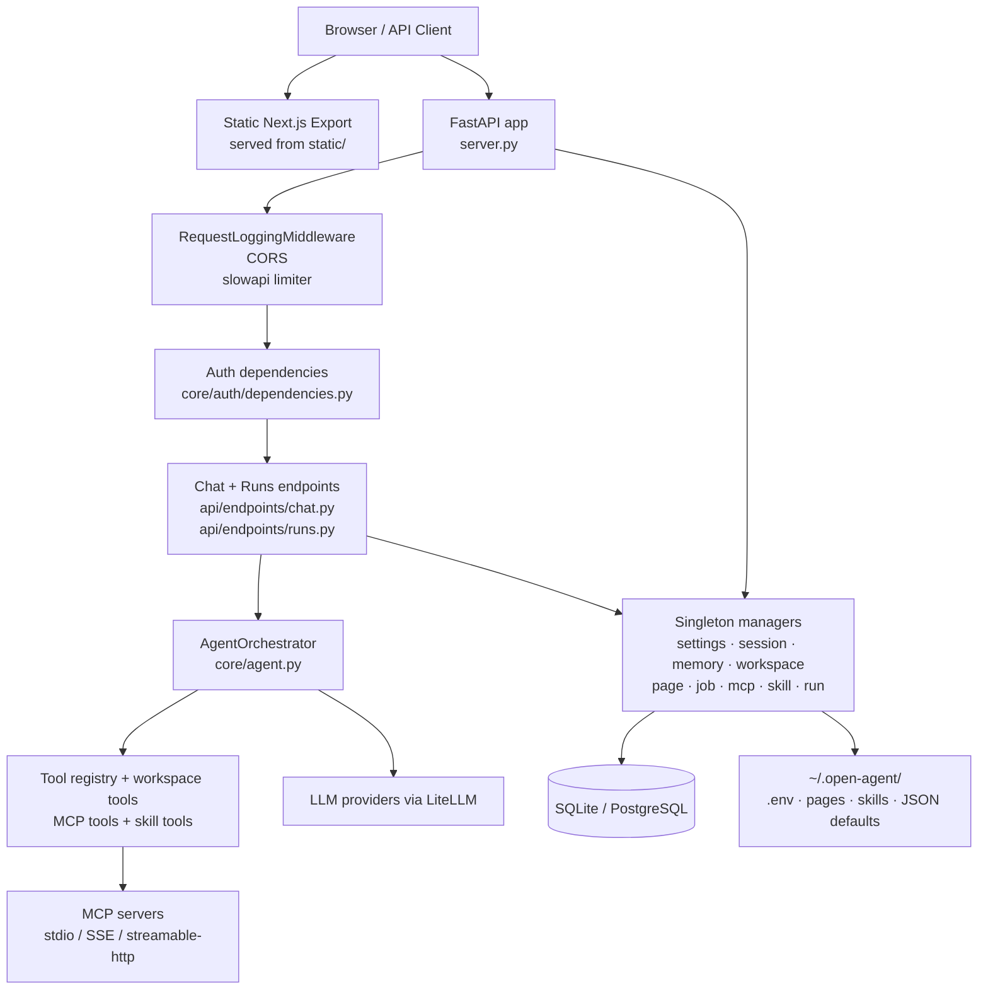

# Open Agent

Open Agent is a local-first AI agent platform built with FastAPI, LiteLLM, MCP, and a SKILL.md-based skill system. It runs a web UI, authenticated API surface, agent runtime, MCP integrations, persistent memory, workspaces, hosted pages, and scheduled jobs inside a single Python application.

The repository is optimized for running on a developer workstation first, then scaling up to a multi-user deployment with PostgreSQL, RBAC, and structured operational controls.

## Why Open Agent exists

Open Agent combines pieces that are usually split across multiple tools:

- **A multi-provider LLM runtime** through LiteLLM
- **A first-class MCP integration layer** for stdio, SSE, and streamable HTTP servers
- **A persistent agent memory model** with long-term facts and session summaries
- **A workspace and file-operation surface** for agent-driven local automation
- **A built-in job system** for scheduled prompts and background automation
- **A browser-facing application** served directly from the same FastAPI server

The project is intentionally local-first:

- configuration lives under `~/.open-agent/`
- SQLite is the zero-config default
- `.env` loading, skill discovery, hosted pages, and JSON-to-DB migration all happen in the server lifespan

## Current status

- **Package name:** `open-agent`
- **Runtime:** Python 3.13+
- **License:** MIT
- **Default transport:** FastAPI + SSE streaming
- **Default database:** SQLite + WAL mode
- **Optional database override:** PostgreSQL via `DATABASE_URL`

See `pyproject.toml`, `server.py`, and `core/db/engine.py` for the authoritative implementation.

## Core capabilities

- **Agent runtime:** `core/agent.py` implements the ReAct-style orchestrator and streaming execution loop.
- **Authentication:** `core/auth/` provides JWT access tokens, refresh token rotation, API keys, and role-based authorization.
- **Persistent memory:** `core/memory_manager.py` stores long-term memories and session summaries.
- **Run ledger:** `core/run_manager.py` and `/api/runs` persist execution status and structured run events.
- **MCP server lifecycle:** `core/mcp_manager.py` loads, connects, audits, and gates external MCP servers.
- **Workspace tools:** `core/workspace_manager.py` and `core/workspace_tools.py` expose file tree, file edits, raw reads, uploads, and shell execution.
- **Hosted pages:** `core/page_manager.py` and `server.py` support public page hosting under `/hosted/*`.
- **Scheduled jobs:** `core/job_manager.py` and `core/job_scheduler.py` execute LLM-backed jobs on a schedule.
- **Task supervision:** `core/task_supervisor.py` tracks long-running background tasks.

## Architecture overview



For a detailed architecture walkthrough with request flow, authentication flow, and schema relationships, see [docs/architecture.md](docs/architecture.md).

Operational references:

- [docs/deployment.md](docs/deployment.md)
- [docs/upgrade.md](docs/upgrade.md)
- [docs/supported-scope.md](docs/supported-scope.md)
- [docs/stabilization-policy.md](docs/stabilization-policy.md)

## Quickstart

### Prerequisites

- Python 3.13+
- [uv](https://docs.astral.sh/uv/)

### 1. Clone and install

```bash
git clone https://github.com/kim62210/open-agent.git
cd open-agent
uv sync --group dev
```

### 2. Initialize the local data directory (recommended)

```bash
uv run open-agent init
```

This creates `~/.open-agent/` and initializes:

- `.env`
- `settings.json`
- `mcp.json`
- `skills.json`
- `pages.json`
- `sessions.json`
- `memories.json`
- `workspaces.json`
- `jobs.json`

> `open-agent start` also calls `init_data_dir()` during startup, so this step is recommended rather than strictly mandatory. Running it explicitly is still the clearest way to inspect and edit your local bootstrap files before the server starts.

### 3. Configure provider credentials

Edit `~/.open-agent/.env` and add only the provider keys you need.

Common variables:

- `OPENAI_API_KEY`
- `ANTHROPIC_API_KEY`
- `GOOGLE_API_KEY`
- `OPENROUTER_API_KEY`
- `GROQ_API_KEY`
- `DEEPSEEK_API_KEY`
- `MISTRAL_API_KEY`

### 4. Start the server

Development mode:

```bash
uv run open-agent start --dev
```

Production-style local run:

```bash
uv run open-agent start
```

Direct uvicorn invocation:

```bash
uv run uvicorn open_agent.server:app --host 127.0.0.1 --port 4821
```

### 5. Verify the instance

- Web UI: `http://127.0.0.1:4821`
- Health endpoint: `GET /api/settings/health`
- Readiness endpoint: `GET /api/settings/readiness`

Example:

```bash
curl http://127.0.0.1:4821/api/settings/health
```

### 6. Create the first user

Register through `POST /api/auth/register`. The first registered user is automatically assigned the `admin` role by `AuthService.register()`.

```bash
curl -X POST http://127.0.0.1:4821/api/auth/register \
  -H "Content-Type: application/json" \
  -d '{
    "email": "admin@example.com",
    "username": "admin",
    "password": "change-me-now"
  }'
```

## API surface

The public API groups below are registered in `server.py` via `app.include_router(...)`.

| Prefix | Purpose | Source file |
|---|---|---|
| `/api/auth` | Registration, login, refresh, profile, API keys, admin user management | `api/endpoints/auth.py` |
| `/api/chat` | Synchronous chat, async chat, SSE streaming chat | `api/endpoints/chat.py` |
| `/api/mcp` | MCP server configuration, connection, tool inspection | `api/endpoints/mcp.py` |
| `/api/skills` | Skill discovery and management | `api/endpoints/skills.py` |
| `/api/pages` | Pages, folders, bundles, publishing, hosted-page metadata | `api/endpoints/pages.py` |
| `/api/settings` | Version, health, readiness, LLM settings, profile, theme, model discovery | `api/endpoints/settings.py` |
| `/api/sessions` | Session CRUD, messages, context status | `api/endpoints/sessions.py` |
| `/api/memory` | Long-term memory CRUD and clearing | `api/endpoints/memory.py` |
| `/api/workspace` | Workspace registration, file tree, raw reads, uploads, shell access | `api/endpoints/workspace.py` |
| `/api/jobs` | Scheduled job CRUD, toggle, history | `api/endpoints/jobs.py` |
| `/api/runs` | Run ledger, run status, abort controls | `api/endpoints/runs.py` |
| `/api/sandbox` | Sandbox escalation and policy controls | `api/endpoints/sandbox.py` |

Additional non-router server endpoints defined directly in `server.py`:

- `/api/host-info`
- `/hosted/`
- `/hosted/{page_id}`
- `/hosted/{page_id}/__version__`

## Configuration

Open Agent mixes filesystem-backed bootstrap defaults with database-backed runtime settings.

### Environment variables

| Variable | Purpose |
|---|---|
| `DATABASE_URL` | Override the default SQLite database with PostgreSQL or another async SQLAlchemy backend |
| `OPEN_AGENT_DEV` | Enable development mode features such as permissive CORS and dev-only bootstrap behavior |
| `OPEN_AGENT_EXPOSE` | Mark the server as LAN-exposed for host-info and CLI behavior |
| `OPEN_AGENT_PORT` | Exposed port metadata used by `/api/host-info` |
| `OPEN_AGENT_DB_ECHO` | Enable SQLAlchemy echo logging when set to `1` |
| `OPEN_AGENT_JWT_SECRET_KEY` | Override the generated JWT signing secret |
| `OPEN_AGENT_ACCESS_TOKEN_EXPIRE_MINUTES` | Access token lifetime |
| `OPEN_AGENT_REFRESH_TOKEN_EXPIRE_DAYS` | Refresh token lifetime |
| `OPEN_AGENT_REGISTRATION_ENABLED` | Enable or disable self-service registration |
| `OPEN_AGENT_AUTO_ADMIN_FIRST_USER` | Promote the first registered user to `admin` |

### Runtime settings model

The persisted application settings are modeled in `models/settings.py`.

| Section | Key options |
|---|---|
| `llm` | model, api_base, api_key override, temperature, max_tokens, max_tool_rounds, deferred tool loading, context compaction threshold, reasoning effort, timeout |
| `memory` | enabled, max_memories, max_injection_tokens, compression threshold, extraction interval |
| `profile` | UI-facing platform and bot naming |
| `theme` | accent color, mode, tone, background image settings, font scale |
| `approval` | risk-based approval toggle, MCP server allowlist, tool allowlist |
| `custom_models` | user-defined model labels mapped to LiteLLM IDs |

### Persistence boundaries

- **Database:** users, auth records, sessions, messages, memories, jobs, workspaces, pages, MCP config, skills config, run ledger
- **Filesystem under `~/.open-agent/`:** `.env`, hosted page assets, bundled or discovered skills, bootstrap JSON defaults, page key-value storage

### Readiness semantics

`GET /api/settings/readiness` currently reports three checks from `api/endpoints/settings.py`:

- `settings_loaded`
- `mcp_config_loaded`
- `job_scheduler_running`

This means a brand-new install with an empty MCP configuration may still report `ready: false` even though the server booted correctly. Treat `health` as the generic “process is alive” probe and `readiness` as a stricter operational check.

## Development

Run the project with the same toolchain the repository uses in CI-like local workflows.

```bash
# Install development dependencies
uv sync --group dev

# Run the full test suite
uv run pytest

# Run lint checks
uv run ruff check .

# Format the codebase
uv run ruff format .

# Run type checks
uv run mypy .
```

Testing details:

- tests use in-memory SQLite fixtures from `tests/conftest.py`
- auth tests disable rate limiting explicitly
- many integration tests override `get_current_user` instead of performing full auth flows
- ORM changes should be accompanied by Alembic revisions under `alembic/versions/`

## Contributing

Open Agent is ready for external contributions, but the repo has a few important boundaries:

- `static/` contains a pre-built Next.js export; the frontend source is not yet published
- `nexus_rust/` contains Rust-backed acceleration modules and compatibility shims
- the runtime is highly stateful, so request isolation, DB migrations, and ownership boundaries matter

See [CONTRIBUTING.md](CONTRIBUTING.md) for development setup, style rules, PR expectations, and test guidance.

## License

Open Agent is released under the [MIT License](LICENSE).
