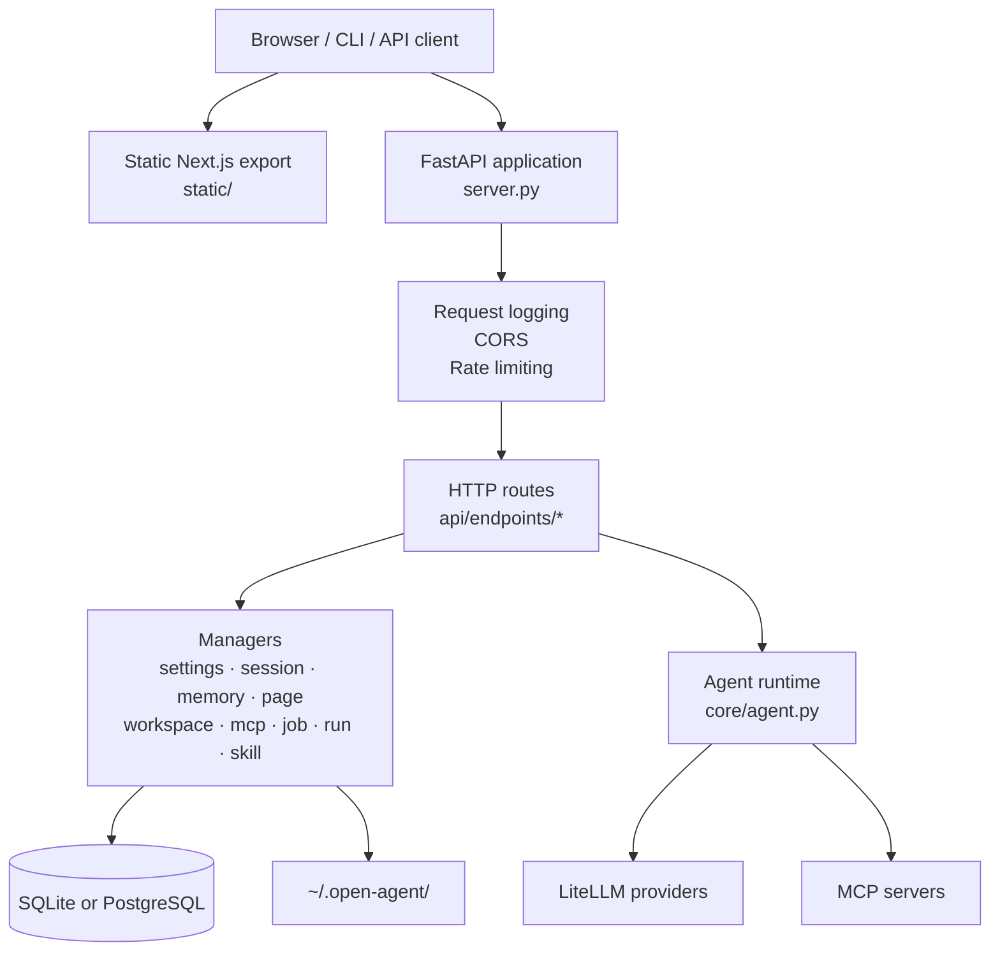
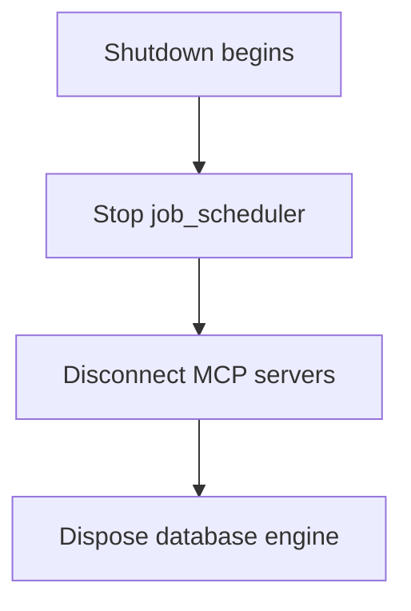
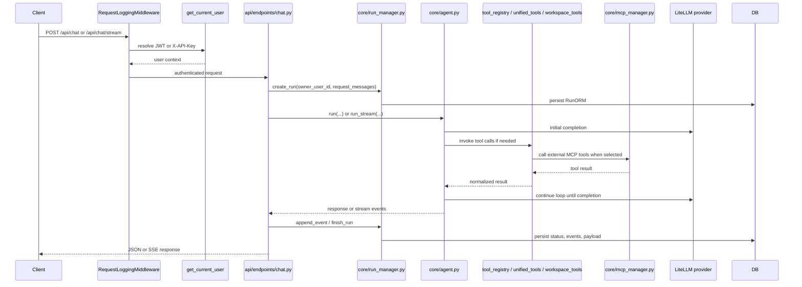
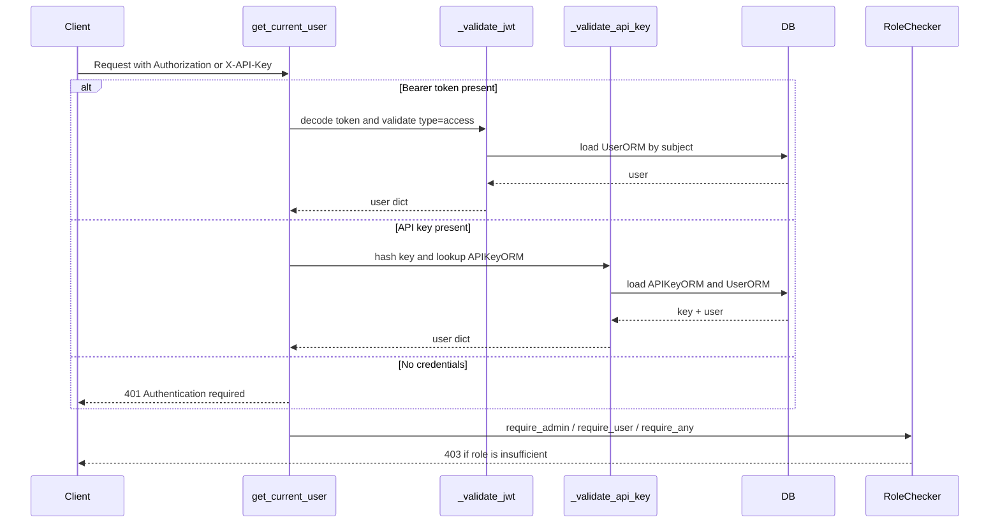
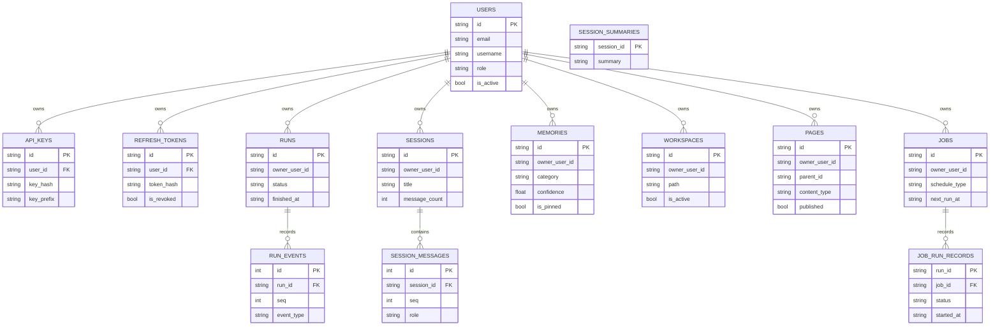

# Open Agent Architecture

This document explains how Open Agent is structured today, how requests move through the runtime, what gets persisted, and where contributors should expect subsystem boundaries.

The document is grounded in the current implementation under `server.py`, `core/`, `api/endpoints/`, and `core/db/`.

## 1. System overview

Open Agent is a single-process FastAPI application that serves four roles at once:

1. **authenticated API server**
2. **browser-facing web app host**
3. **agent runtime and tool orchestrator**
4. **stateful local platform** backed by a database and a filesystem data directory

### Top-level system structure



## 2. Startup and lifecycle

The application lifecycle is defined in `server.py:lifecycle`.

### Startup order

```mermaid
flowchart TD
    A[Process starts] --> B[init_data_dir\nopen_agent.config]
    B --> C[Load ~/.open-agent/.env if present]
    C --> D[Optionally import gh auth token\n(dev only)]
    D --> E[init_db]
    E --> F[migrate_json_to_db]
    F --> G[Load settings_manager]
    G --> H[Load mcp_manager and connect servers]
    H --> I[Load skill_manager and discover skills]
    I --> J[Load page_manager]
    J --> K[Load session_manager]
    K --> L[Load memory_manager]
    L --> M[Load workspace_manager]
    M --> N[Load job_manager]
    N --> O[Start job_scheduler]
    O --> P[Accept traffic]
```

### Shutdown order



### Why this matters

- Skill discovery depends on `~/.open-agent/skills` and `bundled_skills/`.
- MCP connection state is established at startup, not lazily on first API call.
- Legacy JSON migrations are still part of the startup contract.
- Jobs begin running only after settings, workspaces, memory, and pages are loaded.

## 3. HTTP surface

The route groups are registered directly in `server.py`.

| Prefix | Domain | File |
|---|---|---|
| `/api/auth` | registration, login, refresh, profile, API keys, admin user management | `api/endpoints/auth.py` |
| `/api/chat` | sync chat, async chat, stream chat | `api/endpoints/chat.py` |
| `/api/mcp` | MCP server configuration, connection, inspection | `api/endpoints/mcp.py` |
| `/api/skills` | skill discovery and management | `api/endpoints/skills.py` |
| `/api/pages` | pages, folders, publishing, hosted metadata, uploads | `api/endpoints/pages.py` |
| `/api/settings` | version, health, readiness, settings, model discovery | `api/endpoints/settings.py` |
| `/api/sessions` | session CRUD, message persistence, context | `api/endpoints/sessions.py` |
| `/api/memory` | long-term memory CRUD | `api/endpoints/memory.py` |
| `/api/workspace` | workspace registration and file/shell operations | `api/endpoints/workspace.py` |
| `/api/jobs` | scheduled jobs and history | `api/endpoints/jobs.py` |
| `/api/runs` | run ledger, status, abort controls | `api/endpoints/runs.py` |
| `/api/sandbox` | sandbox escalation and policy controls | `api/endpoints/sandbox.py` |

Additional server-owned routes in `server.py`:

- `/api/host-info`
- `/hosted/`
- `/hosted/{page_id}`
- `/hosted/{page_id}/__version__`
- static asset mount and SPA fallback routes

## 4. Request flow

### Chat request flow

The most important runtime path is the chat flow defined in `api/endpoints/chat.py` and `core/agent.py`.



### Async chat control flow

`POST /api/chat/async` creates a run immediately, starts a background task, and returns a `run_id` without waiting for completion.

The run can then be inspected and controlled through:

- `GET /api/runs/{run_id}`
- `GET /api/runs/{run_id}/status`
- `POST /api/runs/{run_id}/abort`

## 5. Authentication and authorization

Open Agent supports two auth paths through `core/auth/dependencies.py`:

- **JWT Bearer tokens** via OAuth2 password bearer
- **API keys** via `X-API-Key`

### Auth flow



### Role model

- `admin`
- `user`
- `viewer`

The first registered account becomes `admin` when `AuthSettings.auto_admin_first_user` is enabled.

### Token model

- access tokens: default 30 minutes
- refresh tokens: default 7 days
- refresh rotation revokes the previous token and issues a new one
- API keys are stored hashed with SHA-256 and only shown once on creation

## 6. Agent runtime

`core/agent.py` is the main orchestrator. It is responsible for:

- selecting workflows
- composing system prompts and resource prompts
- estimating reasoning effort
- loading tools directly or through deferred discovery
- executing tool rounds
- compacting context when needed
- emitting token-level streaming events

### Important runtime design choices

| Mechanism | Location | Why it exists |
|---|---|---|
| Per-request mutable state | `_RequestState` in `core/agent.py` | prevents singleton race conditions |
| Deferred tool loading | `core/tool_registry.py` | avoids flooding the model with every tool at once |
| Observation masking / truncation | `core/agent.py` | keeps the context window usable across long runs |
| Session summaries | `core/memory_manager.py` | compresses prior context for later reuse |
| Run ledger | `core/run_manager.py` | persists request lifecycle and structured events |

## 7. Persistence model

Open Agent persists both relational state and filesystem state.

### Relational model



### Filesystem state

The following live under `~/.open-agent/`:

- `.env`
- `pages/`
- `skills/`
- `sessions/` (legacy JSON compatibility)
- `page_kv/`
- bootstrap JSON config files created by `open_agent.config.init_data_dir()`

### Migration model

Legacy JSON files are imported through `core/db/migrate.py` on startup. Migration is guarded by a `.migrated` marker and now avoids writing that marker when import steps fail.

## 8. Settings and operational surfaces

`api/endpoints/settings.py` exposes both configuration and runtime probes.

### Core settings sections

- `llm`
- `memory`
- `profile`
- `theme`
- `approval`
- `custom_models`

### Operational endpoints

- `GET /api/settings/version`
- `GET /api/settings/health`
- `GET /api/settings/readiness`
- `POST /api/settings/validate-model`
- `GET /api/settings/models/discover`

`health` checks provider reachability. `readiness` is a stricter startup-state probe that currently requires:

- initialized settings
- a non-empty MCP config object
- a running scheduler task

Because of that implementation, a fresh install with no MCP servers configured may still report `ready: false` even though the process is healthy.

## 9. Background execution and supervision

Background tasks are now tracked through `core/task_supervisor.py` instead of relying only on anonymous fire-and-forget tasks.

This currently matters for:

- background session summarization
- job scheduler execution tasks
- async run execution launched by `POST /api/chat/async`

The supervisor records task metadata, finish time, status, and failures for operational introspection.

## 10. Hosted pages and static UI

Open Agent serves both a private application UI and public hosted content.

### UI model

- `static/` contains a pre-built Next.js export
- `server.py` mounts `/_next` and static assets
- the repository does **not** currently include the frontend source tree

### Hosted pages model

- page metadata is stored in `PageORM`
- page files and bundle content are stored on disk
- published pages are exposed under `/hosted/*`
- pages can be optionally password-protected via `host_password_hash`

This dual-surface design is important when changing routing, auth, or static serving logic.

## 11. Contributor caveats

These details are easy to miss if you only skim the repository:

1. The repository directory name (`local-agent`) differs from the Python package import path (`open_agent`).
2. `tests/conftest.py` sets up `sys.modules` aliasing to make that work in tests.
3. The frontend source is not included, only the built static export.
4. Startup still contains legacy migration behavior because the project is mid-transition from JSON persistence to a fully database-backed model.
5. Several subsystems are singletons; mutation paths rely on locks and request-state isolation to stay safe under concurrent access.

## 12. Recommended reading order for contributors

If you are new to the repository, this order gives the fastest architectural understanding:

1. `README.md`
2. `server.py`
3. `core/agent.py`
4. `core/auth/dependencies.py` and `core/auth/service.py`
5. `core/db/engine.py` and `core/db/migrate.py`
6. `tests/conftest.py`
7. the endpoint file or manager relevant to your change
