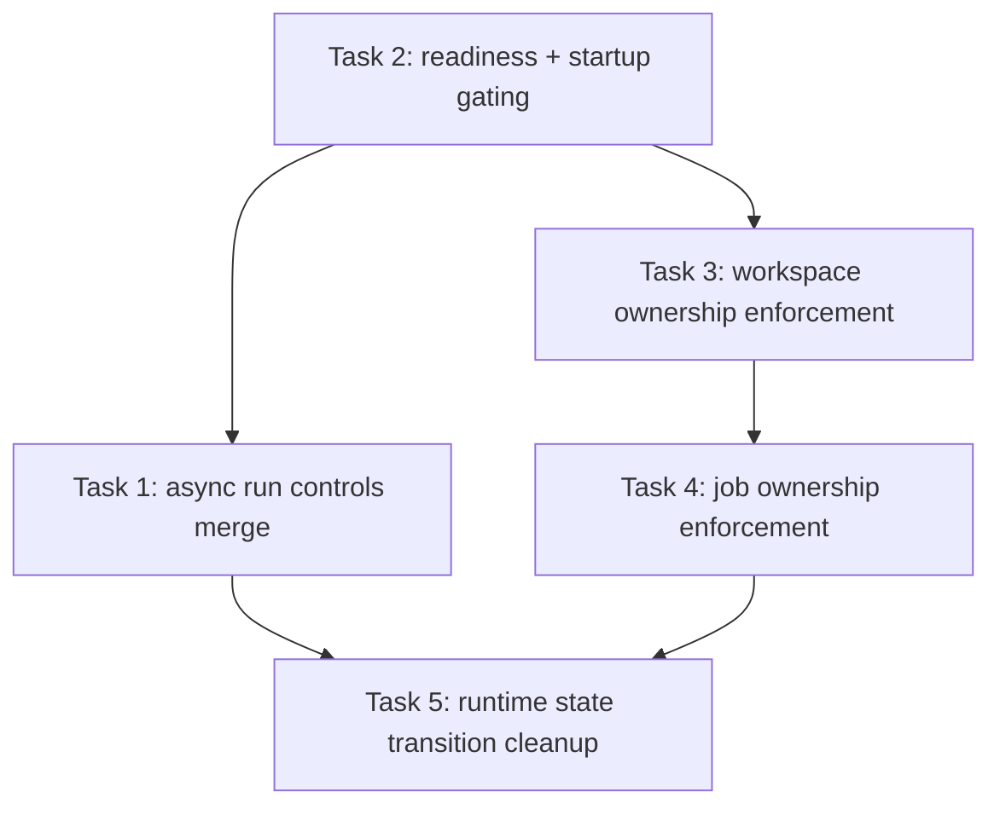

# Sprint 4 Plan — Runtime and Operations Alignment

## Document purpose

This document defines the implementation plan for Sprint 4 before any code changes begin. It is intentionally scoped to the highest-value operational gaps that remain between the current `main` branch and the partially hardened `fix/auth-context-hardening` branch.

Sprint 4 is **not** a feature-expansion sprint. It is a runtime and operations alignment sprint focused on:

1. making the runtime control surface honest and supportable,
2. closing high-risk ownership gaps in workspace and job execution,
3. aligning startup behavior with production expectations, and
4. reducing branch drift between `main` and `fix/auth-context-hardening`.

Implementation should start only after this plan is reviewed and explicitly approved.

---

## 1. Sprint 4 goals and scope definition

### Primary goal

Bring Open Agent to a state where the runtime surface, startup path, and access boundaries are consistent enough to support repeatable operations and clear release readiness.

### In scope

Sprint 4 covers five tightly related workstreams:

1. **Async run controls on `main`**
   - `POST /api/chat/async`
   - `GET /api/runs/{run_id}/status`
   - `POST /api/runs/{run_id}/abort`

2. **Readiness and startup hardening**
   - `GET /api/settings/readiness`
   - dev-only GH token auto-import
   - gated schema bootstrap in `core/db/engine.py`
   - explicit readiness contract for empty-vs-loaded MCP configuration

3. **Workspace ownership enforcement for file operations**
   - ensure file tree/read/write/edit/upload/delete paths respect `owner_user_id`
   - make active workspace state user-scoped instead of global

4. **Job control ownership enforcement**
   - ensure `run` and `stop` controls cannot cross user boundaries
   - cover both API entry points and scheduler/tool-entry execution paths

5. **Runtime state transition cleanup**
   - ensure async run lifecycle and task supervision semantics are explicit and testable

### Explicitly out of scope

The following are intentionally deferred to later sprints:

- CI/CD workflow creation
- release/tag automation
- deployment packaging (Docker, Helm, systemd templates, etc.)
- frontend source publication or UI redesign
- metrics / tracing / OpenTelemetry rollout
- multi-process or distributed execution architecture

### Why this scope is correct

The codebase already contains most core functional domains:

- authentication and RBAC
- persistence and migration
- MCP integration
- sessions, memory, jobs, workspaces, hosted pages
- run ledger and task supervision infrastructure

The current blocker is not product breadth. It is **operational correctness and supportability**.

---

## 2. Detailed implementation plan by task

## Task 1 — Merge and stabilize async run controls on `main`

### Objective

Bring the async execution control surface from `fix/auth-context-hardening` onto `main` in a controlled, test-backed way.

### Why this matters

The current `main` branch already persists runs in `core/run_manager.py` and exposes basic inspection through `api/endpoints/runs.py`, but it does **not** yet support:

- asynchronous run acceptance,
- lightweight status polling, or
- user-driven abort.

That creates a mismatch between runtime capabilities and operator expectations.

### Files to modify

- `api/endpoints/chat.py`
- `api/endpoints/runs.py`
- `core/run_manager.py`
- `models/run.py`
- `tests/integration/test_chat_api.py`
- `tests/integration/test_runs_api.py`

### Planned changes

1. Add `POST /api/chat/async` to return `202 Accepted` with a run stub.
2. Extend `RunManager` with:
   - background task registration
   - status-only lookup
   - abort/cancel support
3. Add run control endpoints:
   - `GET /api/runs/{run_id}/status`
   - `POST /api/runs/{run_id}/abort`
4. Ensure async runs still write structured run events and final status updates.
5. Keep the implementation minimal: no retries, no queue abstraction, no worker pool.

### Why these files

- `api/endpoints/chat.py` already owns sync + stream run creation.
- `api/endpoints/runs.py` already owns run inspection.
- `core/run_manager.py` is the right place for task registration and abort semantics, rather than scattering task maps into endpoints.
- `models/run.py` already contains the run response types and is the correct place for `RunStatus` / async acceptance payloads.

### Verification

- `uv run pytest tests/integration/test_chat_api.py tests/integration/test_runs_api.py -v`
- targeted Ruff/LSP checks on the touched files

---

## Task 2 — Add readiness semantics and production-friendly startup gating

### Objective

Separate “process is alive” from “service is operationally ready”, and remove production-hostile startup shortcuts from the default path.

### Why this matters

Current `main` behavior in `server.py` and `core/db/engine.py` still shows two operational problems:

1. `server.py` attempts GH token auto-import regardless of environment.
2. `core/db/engine.py:init_db()` always executes `create_all()`.

At the same time, `main` has `/health` but not `/readiness`, while docs describe readiness semantics.

### Files to modify

- `api/endpoints/settings.py`
- `api/middleware.py`
- `server.py`
- `core/db/engine.py`
- `tests/integration/test_settings_api.py`
- `tests/integration/test_chat_api.py` *(request-id middleware coverage already exists and should remain aligned)*
- `tests/unit/test_db_engine.py`
- `tests/unit/test_server.py`

### Planned changes

1. Add `GET /api/settings/readiness` with explicit checks:
   - settings initialized
   - MCP config object loaded (not necessarily non-empty server inventory)
   - scheduler task running
2. Keep `/health` as the broad “process + provider connectivity” signal.
3. Gate GH token auto-import behind `OPEN_AGENT_DEV=1`.
4. Gate schema bootstrap (`create_all`) behind:
   - `OPEN_AGENT_DEV=1` or
   - `OPEN_AGENT_BOOTSTRAP_SCHEMA=1`
5. Ensure `RequestLoggingMiddleware` always sets `request.state.request_id` so readiness, runs, and future ops logs can share correlation primitives.
6. Document and test the readiness meaning explicitly: an empty MCP server list must not be treated as “configuration failed to load” unless the implementation intentionally keeps that contract.

### Why these files

- `api/endpoints/settings.py` owns health and version semantics already.
- `server.py` owns startup behavior and lifespan policy.
- `core/db/engine.py` is the single source of truth for bootstrap DB behavior.
- `api/middleware.py` is the correct place to expose request correlation IDs at request scope.

### Verification

- `uv run pytest tests/integration/test_settings_api.py tests/integration/test_chat_api.py -v`
- `uv run pytest tests/unit/test_db_engine.py::TestInitDb::test_init_db_skips_create_all_outside_dev tests/unit/test_server.py::TestLifespan::test_lifespan_does_not_import_gh_token_outside_dev -v`
- `uv run pytest tests/unit/test_middleware.py -v`

---

## Task 3 — Enforce workspace ownership on file-operation paths

### Objective

Close the current mismatch where workspace metadata CRUD is owner-aware but actual file operations are still effectively keyed by `workspace_id` only.

### Why this matters

The current API layer in `api/endpoints/workspace.py` passes `owner_user_id` for workspace CRUD methods, but file operations such as:

- tree
- file read
- raw file access
- upload
- rename
- mkdir
- delete
- write
- edit

still call `WorkspaceManager` methods without user ownership checks.

This is one of the highest-risk security and tenancy gaps in the codebase.

### Files to modify

- `api/endpoints/workspace.py`
- `core/workspace_manager.py`
- `core/db/repositories/workspace_repo.py`
- `core/workspace_tools.py`
- `core/unified_tools.py`
- `tests/integration/test_workspace_api.py`
- `tests/unit/test_workspace_manager.py`
- `tests/unit/test_workspace_tools.py`

### Planned changes

1. Add `owner_user_id` parameters to the file-operation methods in `WorkspaceManager`.
2. Enforce ownership before resolving filesystem paths.
3. Update API routes to pass `current_user["id"]` for all file operations.
4. Change workspace active-state persistence from global toggling to user-scoped toggling.
5. Update `WorkspaceRepository.set_active()` and related queries to avoid clearing another user's active workspace.
6. Replace global active-workspace assumptions in tool routing with user-scoped resolution where possible.
7. Keep changes focused: no full workspace session system, no multi-active-workspace redesign beyond user scoping.

### Why these files

- `api/endpoints/workspace.py` is where user context currently gets dropped.
- `core/workspace_manager.py` is where ownership needs to be enforced before path access and where active-state behavior currently stays global.
- `core/db/repositories/workspace_repo.py` is required because active-state writes must become owner-scoped at the persistence layer.
- `core/workspace_tools.py` and `core/unified_tools.py` are necessary because agent tools otherwise bypass the API-layer fixes.

### Verification

- Add or expand tests showing that cross-user workspace file access is denied.
- Add tests showing one user's `activate` or `deactivate` action does not affect another user's active workspace.
- `uv run pytest tests/integration/test_workspace_api.py tests/unit/test_workspace_manager.py tests/unit/test_workspace_tools.py -v`

---

## Task 4 — Enforce job ownership on manual run/stop controls

### Objective

Make job control endpoints align with the owner-aware job CRUD model.

### Why this matters

`api/endpoints/jobs.py` already uses owner-aware access for listing, reading, updating, deleting, and toggling jobs. However, the manual execution controls (`run_now`, `stop_job`) still risk using scheduler paths that do not receive ownership context.

This makes Sprint 4 incomplete if left unaddressed, because jobs are part of the same runtime-operations surface as runs.

### Files to modify

- `api/endpoints/jobs.py`
- `core/job_scheduler.py`
- `core/job_manager.py`
- `core/job_executor.py` *(only if execution entry requires owner-aware context propagation)*
- `tests/integration/test_jobs_api.py`
- `tests/unit/test_job_scheduler.py`

### Planned changes

1. Add explicit owner validation before manual run/stop actions.
2. Ensure scheduler-level lookups do not act on a job unless the requesting user owns it (or is explicitly allowed via admin policy).
3. Verify the scheduled execution entry path also preserves ownership assumptions, so jobs cannot bypass API ownership guarantees once enqueued.
4. Keep the fix surgical: do not redesign scheduler ownership models beyond the endpoints and required manager/executor hooks.

### Verification

- add owner-denial test cases for manual job control
- `uv run pytest tests/integration/test_jobs_api.py tests/unit/test_job_scheduler.py -v`

---

## Task 5 — Align runtime state transitions and operational contracts

### Objective

Make run/task/job/workspace state transitions explicit enough that Sprint 5 can build CI and release checks on them.

### Why this matters

The current code already records many state transitions, but they are spread across:

- `core/run_manager.py`
- `core/job_manager.py`
- `core/job_scheduler.py`
- `core/task_supervisor.py`
- `core/workspace_manager.py`

Sprint 4 should not introduce a new workflow engine, but it should leave these transitions testable and understandable.

### Files to modify

- `core/run_manager.py`
- `core/job_manager.py`
- `core/job_scheduler.py`
- `core/task_supervisor.py`
- relevant tests under `tests/unit/` and `tests/integration/`

### Planned changes

1. Verify that async run cancelation always produces a terminal run state.
2. Confirm that scheduler-supervised tasks are observable and do not silently remain untracked.
3. Make sure workspace active-state logic stays user-scoped after ownership fixes.
4. Add tests where state can otherwise drift silently (cancel without done, stop without owner match, etc.).

### Important boundary

This task is **cleanup and contract alignment**, not a new feature area. If a change introduces queueing, retries, distributed workers, or persistent task orchestration, it belongs in a later sprint.

### Verification

- targeted run/job/task lifecycle tests
- no new undocumented state strings or implicit terminal conditions

---

## 3. Dependencies and execution order

Sprint 4 should be executed in the following order.

### Why this order is correct

1. **Task 2 first**
   - startup and readiness semantics affect the operational contract of the whole sprint.
   - this also reduces the chance of documenting or testing a false readiness model.

2. **Task 1 second**
   - async run control merge is already mostly implemented on the feature branch and is relatively self-contained.
   - it should land before deeper state-transition cleanup.

3. **Task 3 third**
   - workspace ownership enforcement has the largest security risk and the widest hidden access surface.
   - it should happen before more tooling or job behavior depends on workspace behavior.

4. **Task 4 fourth**
   - job control ownership is narrower once workspace and user-scoped runtime assumptions are clarified.

5. **Task 5 last**
   - cleanup is safest after the major behavior changes land, so the final lifecycle contract reflects the new reality.

---

## 4. Expected risks and likely conflict points

## Risk 1 — `server.py` lifespan is a merge hotspot

### Why

`server.py` already concentrates:

- data-dir bootstrap
- `.env` loading
- GH token import
- DB init + migration
- manager load sequence
- scheduler lifecycle
- router registration

### Impact

Any Sprint 4 work that touches startup or route registration will likely conflict here.

### Mitigation

- keep startup edits minimal and isolated
- separate readiness endpoint changes into `api/endpoints/settings.py` where possible
- avoid mixing unrelated cleanup into `server.py`

## Risk 2 — Alembic / startup DB contract drift

### Why

The codebase already has Alembic revisions, but `main` startup still uses `create_all()` semantics by default.

### Impact

If Sprint 4 changes startup assumptions without clarifying migration expectations, existing installs may behave inconsistently across SQLite/Postgres or fresh vs upgraded databases.

### Mitigation

- treat `init_db()` changes as operational contract work, not a cleanup side quest
- do not add new schema changes in Sprint 4 unless strictly required
- keep owner-enforcement fixes at API/manager boundaries unless storage changes become unavoidable

## Risk 3 — Workspace security fixes can break agent tooling unexpectedly

### Why

`api/endpoints/workspace.py`, `core/workspace_manager.py`, `core/workspace_tools.py`, and `core/unified_tools.py` all participate in file access, but they do not currently share a single ownership contract.

### Impact

Fixing the API surface only may leave agent tools unsafe. Fixing tools only may break existing tests or active-workspace assumptions.

### Mitigation

- define the ownership contract once before editing
- implement boundary enforcement in both API and tool entry points
- write denial tests before behavior changes

## Risk 3a — Active workspace state is currently global, not user-scoped

### Why

`WorkspaceRepository.set_active()` and the manager-level activation flow currently behave like there is exactly one active workspace for the whole system.

### Impact

Even if file CRUD becomes owner-aware, active workspace resolution in tools can still leak cross-user behavior.

### Mitigation

- treat active workspace scoping as part of Task 3, not a later cleanup item
- change both repository and manager logic in the same PR
- add tests for parallel users with distinct active workspaces

## Risk 4 — Async run control merge may introduce lifecycle edge cases

### Why

The feature branch async controls are useful, but they add background-task registration, cancellation, and new terminal states.

### Impact

- double-finish of runs
- cancelled runs without terminal state
- SSE/async differences drifting apart

### Mitigation

- land the merge with minimal semantic changes first
- add explicit tests for `running -> completed`, `running -> failed`, and `running -> cancelled`

## Risk 5 — Branch drift outside Sprint 4 scope

### Why

The feature branch contains Sprint-4-relevant work, but branch comparisons also showed unrelated drift such as skills and ignore-file history.

### Impact

Cherry-picking or broad merges may pull in non-Sprint-4 noise.

### Mitigation

- merge or cherry-pick by bounded file set
- avoid branch-wide merges until Sprint 4 targets are isolated

---

## 5. Definition of Done

Sprint 4 is complete only when **all** of the following are true.

### Runtime and API

- `main` exposes:
  - `POST /api/chat/async`
  - `GET /api/runs/{run_id}/status`
  - `POST /api/runs/{run_id}/abort`
  - `GET /api/settings/readiness`
- the semantics of `health` vs `readiness` are documented and reflected in code

### Security and ownership

- workspace file operations reject cross-user access at both API and tool-entry boundaries
- active workspace state is user-scoped, not globally shared across users
- manual job run/stop controls cannot cross ownership boundaries
- scheduler/job execution entry paths do not bypass ownership guarantees established at the API boundary
- no endpoint accepts authenticated user context and then silently drops ownership checks on the way to a filesystem or scheduler action

### Startup behavior

- GH token auto-import is development-only
- schema bootstrap through `create_all()` is development/bootstrap-only
- startup behavior is consistent with docs and tests

### State transitions

- async runs always end in a terminal state (`completed`, `failed`, or `cancelled`)
- background tasks created by Sprint 4 changes are supervised or intentionally scoped
- no new undocumented state transitions are introduced

### Verification

- all new behavior has targeted tests
- touched test suites pass
- touched files are Ruff-clean
- touched files have no new LSP diagnostics
- docs referencing Sprint 4 behavior are updated if contracts change

### Release readiness for next sprint

- the project is in a state where Sprint 5 can focus on CI, releases, and deployment rather than still fixing runtime contract mismatches

---

## 6. Suggested implementation batches

To keep code review manageable, Sprint 4 should land as four PRs rather than one large merge.

### PR 1 — Startup and readiness hardening

- `server.py`
- `core/db/engine.py`
- `api/endpoints/settings.py`
- targeted tests

### PR 2 — Async run controls

- `api/endpoints/chat.py`
- `api/endpoints/runs.py`
- `core/run_manager.py`
- `models/run.py`
- targeted tests

### PR 3 — Workspace ownership enforcement

- `api/endpoints/workspace.py`
- `core/workspace_manager.py`
- `core/db/repositories/workspace_repo.py`
- `core/workspace_tools.py`
- `core/unified_tools.py`
- targeted tests

### PR 4 — Job ownership + lifecycle cleanup

- `api/endpoints/jobs.py`
- `core/job_scheduler.py`
- `core/job_manager.py`
- task/run tests

This split minimizes conflicts and keeps the sprint reviewable.
